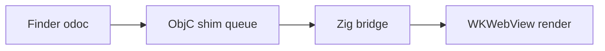

# Rich fixture

Intro paragraph with **bold**, *italic*, `inline code`, ~~strikethrough~~, and
an autolink https://example.com plus a [relative link](./second.md) and an
[external link](https://github.com/vercel-labs/native).

## Tables

| Metric | Target | Current |
|---|---|---|
| CAC:LTGP | 1:3 | 1.53 |
| AOV | $1,500 | $1,314 |

## Task lists

- [x] Spike passed
- [ ] Frontend build
- [ ] Ship

## Code

```python
def hello(name: str) -> str:
    return f"hello {name}"  # comment
```

```bash
zig build package -Doptimize=ReleaseSafe
open -a mdv.app README.md
```

## Mermaid



## Long section for TOC and scroll tests

### Subsection one

Lorem ipsum dolor sit amet, consectetur adipiscing elit. Quote below:

> Verification is the bottleneck. Generation is cheap.

### Subsection two

1. First
2. Second
3. Third

Horizontal rule:

---

Final paragraph after the rule.
